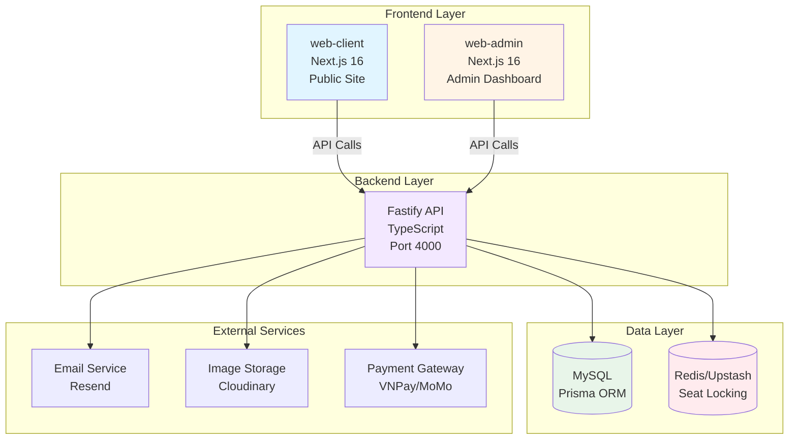

# TEDxFPTUniversityHCMC 2026 - Architecture Overview

> **🎯 For:** All team members (junior to senior developers)  
> **📅 Last Updated:** 2026-06-13  
> **🔗 Next:** [System Architecture](./01-system-architecture.md)

---

## 📖 What is This Project?

**TEDx Ticketing Platform** là hệ thống bán vé sự kiện TEDx với khả năng xử lý đồng thời cao, đảm bảo **zero overselling** (không bán vượt quá số ghế).

### Core Business Problem

Khi hàng nghìn người cùng lúc mua vé cho sự kiện hot:

- ❌ **Without proper locking:** 2 người có thể mua cùng 1 ghế
- ❌ **Database locks:** Slow, không scale trên serverless
- ✅ **Our solution:** Redis-based distributed locking với TTL

---

## 🏗️ System Architecture (High-Level)



---

## 🎯 Key Features

### 1. Anti-Overselling System

**Problem:** Ghế có thể bị bán 2 lần khi nhiều người đặt cùng lúc
**Solution:** Redis distributed locks với atomic operations

```typescript
// Simplified flow
1. User clicks seat → System locks in Redis (5 min TTL)
2. User pays → Seat marked SOLD in MySQL
3. TTL expires → Unpaid seats auto-released
```

### 2. Serverless-Safe Design

- **Stateless:** Không lưu state trong memory
- **Webhook-driven:** Payment confirmation qua webhooks
- **Retry-safe:** Idempotent operations

### 3. Three-Tier Architecture

```
┌─────────────┐
│  Frontend   │ ← User Interface (Next.js SSR/CSR)
├─────────────┤
│   Backend   │ ← Business Logic (Fastify API)
├─────────────┤
│    Data     │ ← Persistence (MySQL + Redis)
└─────────────┘
```

---

## 📊 Technology Stack

| Layer                 | Technology                        | Purpose                  |
| --------------------- | --------------------------------- | ------------------------ |
| **Frontend (Client)** | Next.js 16, React 19, TailwindCSS | Public event website     |
| **Frontend (Admin)**  | Next.js 16, Ant Design, React 19  | Admin dashboard          |
| **Backend API**       | Fastify 5, TypeScript, Prisma     | RESTful API server       |
| **Database**          | MySQL 8                           | Primary data storage     |
| **Cache/Lock**        | Redis (Upstash)                   | Seat locking & caching   |
| **Auth**              | JWT (jsonwebtoken)                | Stateless authentication |
| **Email**             | Resend API                        | Transactional emails     |
| **Storage**           | Cloudinary                        | Image CDN                |
| **Payment**           | VNPay, MoMo, ZaloPay              | Payment gateways         |
| **Deployment**        | VPS (PM2) + Vercel                | Backend + Frontends      |

---

## 🔄 Critical Flows

### 1. Seat Booking Flow

```
User → Select Seats → Redis Lock (5min) → Create Order → Payment → Confirm → SOLD
                ↓
         TTL Expired → Auto-release if unpaid
```

### 2. Payment Flow

```
Order Created → Payment Gateway → User Pays → Webhook → Backend Confirms → Email Ticket
```

### 3. Access Token Flow (Security)

```
Order Confirmed → Generate Token → Save Plaintext + Hash → Email Link → User Views Ticket
                                                         ↓
                                            Token verified via Hash
```

---

## 🎓 For Junior Developers

**Start Here:**

1. [System Architecture](./01-system-architecture.md) - Hiểu các services giao tiếp thế nào
2. [Development Guide](./08-development-guide.md) - Setup local environment
3. [Business Flows](./04-business-flows.md) - Hiểu user journey

**Key Concepts to Learn:**

- RESTful APIs
- JWT Authentication
- Redis Locking
- Webhook handling

---

## 🏗️ For Senior Developers

**Architecture Decisions:**

- Why Fastify over Express? → Performance + TypeScript-first
- Why Redis for locking? → Distributed, TTL support, fast
- Why plaintext token storage? → UX (preserve user links) vs Security trade-off

**Read These:**

1. [Backend Architecture](./02-backend-architecture.md) - Controllers/Services pattern
2. [Security Model](./07-security-model.md) - Auth & access control
3. [Database Schema](./03-database-schema.md) - ERD & indexes

---

## 📂 Repository Structure

```
project-detedxs26/
├── backend/              # Fastify API (TypeScript)
│   ├── src/
│   │   ├── controllers/  # Route handlers
│   │   ├── services/     # Business logic
│   │   ├── middleware/   # Auth, error handling
│   │   └── routes/       # Route definitions
│   └── prisma/           # Database schema
├── web-client/           # Public website (Next.js)
├── web-admin/            # Admin dashboard (Next.js)
└── docs/                 # Documentation (you are here)
```

---

## 🚀 Quick Start

```bash
# 1. Clone repository
git clone https://github.com/ttphats/project-detedxs26.git

# 2. Start backend
cd backend
npm install
npm run dev          # http://localhost:4000

# 3. Start web-client
cd web-client
npm install
npm run dev          # http://localhost:3000

# 4. Start web-admin
cd web-admin
npm install
npm run dev          # http://localhost:3002
```

**Default credentials:**

- Email: `admin@tedxfptuhcm.com`
- Password: `admin123456`

---

## 📚 Documentation Index

| Document                                                     | Audience      | Purpose                 |
| ------------------------------------------------------------ | ------------- | ----------------------- |
| **00-overview.md** (this)                                    | Everyone      | High-level architecture |
| [01-system-architecture.md](./01-system-architecture.md)     | All devs      | Services & deployment   |
| [02-backend-architecture.md](./02-backend-architecture.md)   | Backend devs  | Fastify structure       |
| [03-database-schema.md](./03-database-schema.md)             | All devs      | Data models             |
| [04-business-flows.md](./04-business-flows.md)               | All devs      | User journeys           |
| [05-api-reference.md](./05-api-reference.md)                 | Frontend/QA   | API endpoints           |
| [06-frontend-architecture.md](./06-frontend-architecture.md) | Frontend devs | Next.js apps            |
| [07-security-model.md](./07-security-model.md)               | All devs      | Auth & security         |
| [08-development-guide.md](./08-development-guide.md)         | New devs      | Setup & workflows       |
| [09-deployment-guide.md](./09-deployment-guide.md)           | DevOps        | Production deploy       |

---

## 🤝 Contributing

Before making changes:

1. Read relevant architecture docs
2. Understand affected flows
3. Update documentation if architecture changes
4. Follow existing patterns

---

**Next:** [System Architecture →](./01-system-architecture.md)
