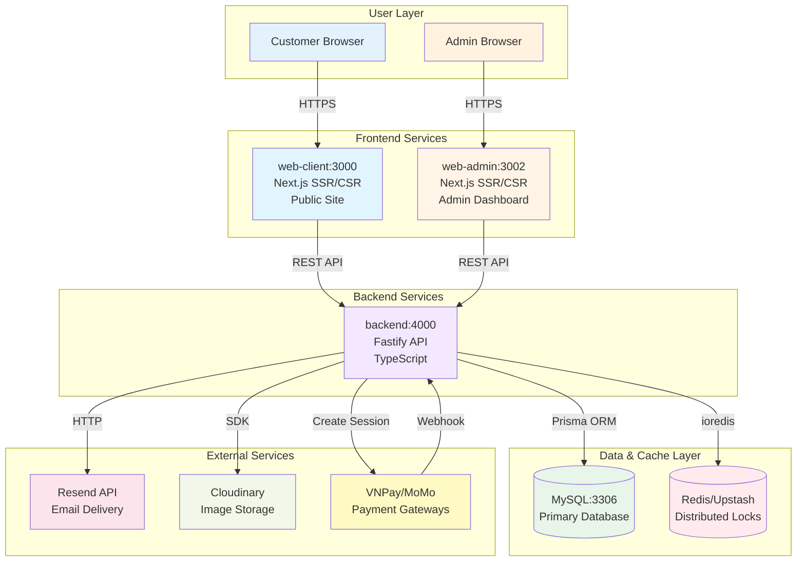
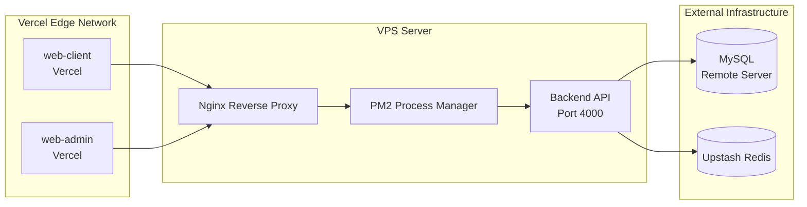
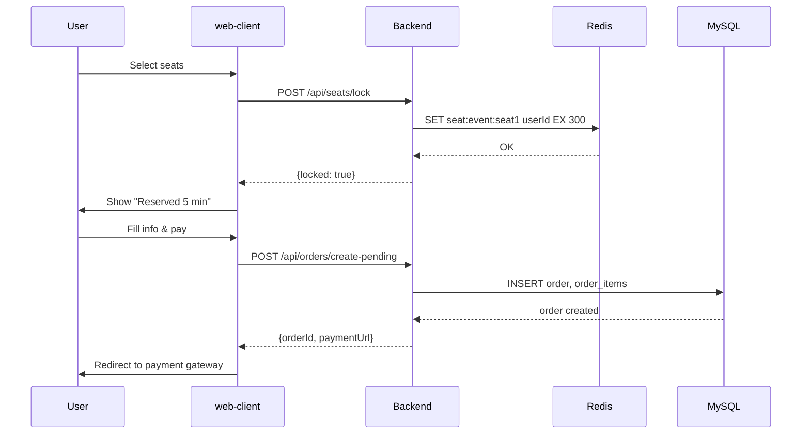
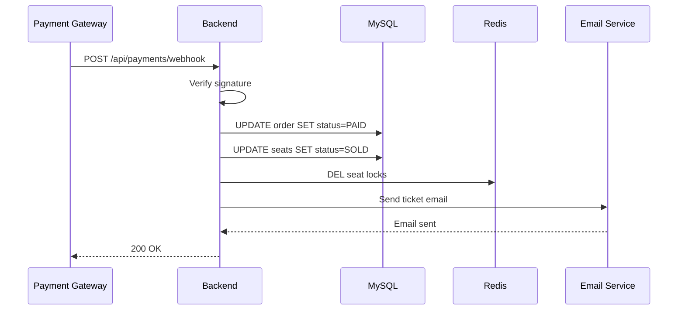

# System Architecture

> **🎯 For:** All developers  
> **📅 Last Updated:** 2026-06-13  
> **🔗 Previous:** [Overview](./00-overview.md) | **Next:** [Backend Architecture](./02-backend-architecture.md)

---

## 📐 Architecture Overview

TEDx Ticketing Platform sử dụng **microservices-inspired** architecture với 3 services chính:

1. **Backend API** (Fastify) - Business logic & data orchestration
2. **Web Client** (Next.js) - Public-facing event website
3. **Web Admin** (Next.js) - Admin dashboard & management

---

## 🏗️ Services Topology



---

## 🔌 Service Communication

### 1. Frontend → Backend Communication

**Protocol:** RESTful HTTP/HTTPS  
**Format:** JSON  
**Authentication:** JWT Bearer token

```typescript
// Example: web-client calls backend
const response = await fetch("http://localhost:4000/api/events", {
  method: "GET",
  headers: {
    "Content-Type": "application/json",
  },
});
const events = await response.json();
```

### 2. Backend → Database Communication

**ORM:** Prisma Client  
**Connection:** MySQL connection pool (mysql2)  
**Transactions:** Supported via Prisma

```typescript
// Example: Backend queries database
const order = await prisma.order.findUnique({
  where: { id: orderId },
  include: { orderItems: true, event: true },
});
```

### 3. Backend → Redis Communication

**Client:** ioredis (for self-hosted) or @upstash/redis  
**Usage:** Seat locking with TTL

```typescript
// Example: Lock seat in Redis
await redis.set(
  `seat:${eventId}:${seatId}`,
  userId,
  "EX",
  300, // 5 minutes TTL
);
```

---

## 💾 Data Layer Architecture

### Database: MySQL

**Host:** Remote server (103.179.188.241:3306)  
**Schema Management:** Prisma Migrate  
**Connection Pool:** max 10 connections

**Key Features:**

- ACID transactions
- Foreign key constraints
- Indexes for performance
- Audit logging

### Cache/Lock: Redis (Upstash)

**Purpose:**

1. **Seat Locking:** Distributed locks với TTL
2. **Rate Limiting:** API rate limits
3. **Session Cache:** (future)

**Why Redis for Locking?**

- ✅ Atomic operations (`SET NX EX`)
- ✅ Auto-expiration (TTL)
- ✅ Distributed (works across multiple backend instances)
- ✅ Fast (in-memory)

---

## 🌐 External Services Integration

### 1. Email Service (Resend)

**Purpose:** Transactional emails (ticket confirmation, reminders)  
**API:** REST API với API key  
**Endpoint:** `https://api.resend.com/emails`

**Email Types:**

- Order confirmation với ticket QR code
- Payment confirmation
- Event reminders

### 2. Image Storage (Cloudinary)

**Purpose:** Event banners, speaker photos  
**Upload:** Signed uploads via SDK  
**Delivery:** CDN URLs

**Folder Structure:**

```
tedx-fptuhcmc/
├── events/
│   ├── {event-id}-banner.jpg
│   └── {event-id}-thumbnail.jpg
└── speakers/
    └── {speaker-id}.jpg
```

### 3. Payment Gateways

**Supported:**

- VNPay (Vietnamese cards)
- MoMo (e-wallet)
- ZaloPay (e-wallet)

**Flow:**

1. Backend creates payment session
2. User redirected to gateway
3. Gateway sends webhook on completion
4. Backend processes webhook → confirms order

---

## 🚀 Deployment Architecture

### Production Setup



### Backend Deployment (VPS)

**Process Manager:** PM2  
**Environment:** Node.js 20+  
**Build:** TypeScript → JavaScript (dist/)

```bash
# Deployment steps
npm run build        # Compile TypeScript
pm2 restart backend  # Restart process
```

**Config:** `ecosystem.config.js`

```javascript
module.exports = {
  apps: [
    {
      name: "tedx-backend",
      script: "./dist/index.js",
      instances: 1,
      env_production: {
        NODE_ENV: "production",
        PORT: 4000,
      },
    },
  ],
};
```

### Frontend Deployment (Vercel)

**web-client:** https://tedxfptuniversityhcmc.com
**web-admin:** https://admin.tedxfptuniversityhcmc.com

**Build Command:** `npm run build`
**Output:** `.next/` (Next.js static + serverless)

---

## 🔐 Network & Security

### CORS Configuration

Backend allows requests from:

- `http://localhost:3000` (dev - web-client)
- `http://localhost:3002` (dev - web-admin)
- `https://tedxfptuniversityhcmc.com` (prod - web-client)
- `https://admin.tedxfptuniversityhcmc.com` (prod - web-admin)
- `*.vercel.app` (Vercel preview deployments)

### SSL/TLS

- **Frontend:** Vercel automatic SSL
- **Backend:** Nginx với Let's Encrypt

---

## 📊 Data Flow Examples

### Example 1: User Books Ticket



### Example 2: Payment Webhook



---

## 🎯 Scalability Considerations

### Current Limits

| Resource          | Limit     | Bottleneck        |
| ----------------- | --------- | ----------------- |
| MySQL connections | 10        | Database server   |
| Redis operations  | ~100k/sec | Upstash free tier |
| Backend instances | 1 (PM2)   | Single VPS        |
| Concurrent users  | ~500      | Backend CPU       |

### Future Scaling Options

**Horizontal Scaling:**

- Multiple backend instances behind load balancer
- Redis Cluster for higher throughput
- Read replicas for MySQL

**Vertical Scaling:**

- Upgrade VPS (more CPU/RAM)
- Increase MySQL connection pool

---

## 🔧 Technology Choices - Why?

### Why Fastify over Express?

| Feature            | Fastify        | Express         |
| ------------------ | -------------- | --------------- |
| TypeScript support | First-class    | Requires @types |
| Performance        | ~2x faster     | Baseline        |
| Schema validation  | Built-in (Zod) | Manual          |
| Async/await        | Native         | Plugin needed   |

### Why Next.js for Frontend?

- ✅ SSR for SEO (event pages)
- ✅ API routes (web-admin hybrid)
- ✅ File-based routing
- ✅ Built-in optimization

### Why MySQL over PostgreSQL?

- ✅ Existing infrastructure
- ✅ Team familiarity
- ✅ Sufficient for use case
- ✅ Prisma supports both equally

### Why Redis over In-Memory?

| In-Memory           | Redis          |
| ------------------- | -------------- |
| Lost on restart     | Persistent     |
| Single instance     | Distributed    |
| No TTL              | Built-in TTL   |
| Not serverless-safe | Works anywhere |

---

## 📈 Monitoring & Observability

### Backend Logs

**Logger:** Pino (structured JSON logs)
**Destination:** Console → PM2 → log files

```bash
pm2 logs tedx-backend --lines 100
```

### Database Monitoring

**Tool:** Prisma Studio (dev only)

```bash
npx prisma studio
```

### Error Tracking

**Current:** Console logs
**Recommended:** Sentry (future)

---

## 🔄 Disaster Recovery

### Database Backups

**Frequency:** Daily (manual)
**Retention:** 7 days
**Location:** Remote server backups

### Application Recovery

**RTO (Recovery Time Objective):** < 1 hour
**RPO (Recovery Point Objective):** < 24 hours

**Steps:**

1. Restore database from backup
2. Redeploy backend from Git
3. Redeploy frontends from Vercel

---

**Next:** [Backend Architecture →](./02-backend-architecture.md)
