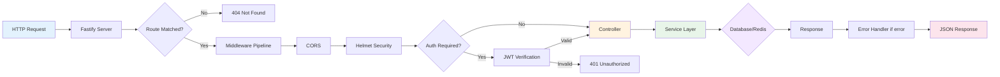
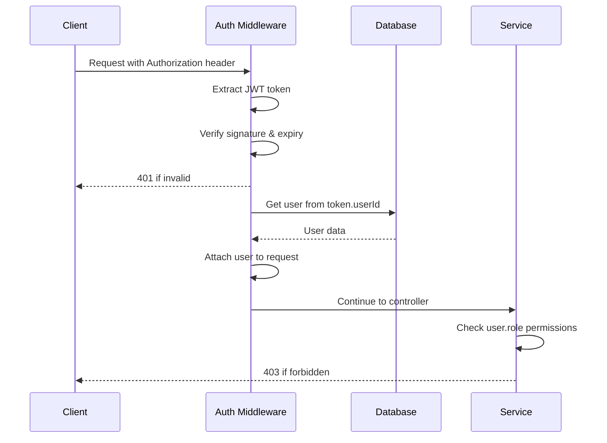

# Backend Architecture

> **🎯 For:** Backend developers  
> **📅 Last Updated:** 2026-06-13  
> **🔗 Previous:** [System Architecture](./01-system-architecture.md) | **Next:** [Database Schema](./03-database-schema.md)

---

## 📐 Backend Overview

**Framework:** Fastify 5.x  
**Language:** TypeScript 5.x  
**Runtime:** Node.js 20+  
**Port:** 4000  
**Architecture Pattern:** Layered (Routes → Controllers → Services)

---

## 🏗️ Project Structure

```
backend/
├── src/
│   ├── config/              # Configuration
│   │   └── env.ts           # Environment variables
│   │
│   ├── controllers/         # Request handlers
│   │   ├── admin/           # Admin-only controllers
│   │   │   ├── orders.controller.ts
│   │   │   ├── events.controller.ts
│   │   │   └── users.controller.ts
│   │   ├── auth.controller.ts
│   │   ├── event.controller.ts
│   │   ├── order.controller.ts
│   │   ├── payment.controller.ts
│   │   ├── seat.controller.ts
│   │   └── ticket.controller.ts
│   │
│   ├── services/            # Business logic
│   │   ├── admin/           # Admin service layer
│   │   │   └── orders.service.ts
│   │   ├── auth.service.ts
│   │   ├── email.service.ts
│   │   ├── order.service.ts
│   │   ├── qrcode.service.ts
│   │   └── seat-lock.service.ts
│   │
│   ├── routes/              # Route definitions
│   │   ├── admin.routes.ts  # Admin routes
│   │   ├── auth.routes.ts   # Auth routes
│   │   ├── public.routes.ts # Public routes
│   │   └── index.ts         # Route aggregator
│   │
│   ├── middleware/          # Middleware functions
│   │   ├── auth.ts          # JWT authentication
│   │   ├── error-handler.ts # Global error handler
│   │   └── rate-limit.ts    # Rate limiting
│   │
│   ├── db/                  # Database clients
│   │   ├── prisma.ts        # Prisma ORM
│   │   ├── mysql.ts         # Raw MySQL pool
│   │   └── redis.ts         # Redis client
│   │
│   ├── utils/               # Utility functions
│   │   ├── auth.ts          # Auth helpers (hash, verify)
│   │   ├── errors.ts        # Custom error classes
│   │   └── helpers.ts       # General utilities
│   │
│   ├── types/               # TypeScript types
│   │   └── index.ts         # Shared types
│   │
│   └── index.ts             # Application entry point
│
├── prisma/
│   ├── schema.prisma        # Database schema
│   └── migrations/          # Database migrations
│
├── public/                  # Static files
├── dist/                    # Compiled JavaScript (build output)
├── scripts/                 # Utility scripts
├── package.json
├── tsconfig.json
└── ecosystem.config.js      # PM2 configuration
```

---

## 🔄 Request Flow



---

## 📋 Layered Architecture

### Layer 1: Routes

**Purpose:** URL to controller mapping  
**Location:** `src/routes/`  
**Responsibility:** Define HTTP methods & paths

```typescript
// src/routes/public.routes.ts
export async function registerPublicRoutes(fastify: FastifyInstance) {
  // GET /api/events - List all public events
  fastify.get("/events", eventController.listEvents);

  // POST /api/orders/create-pending - Create order
  fastify.post("/orders/create-pending", orderController.createPending);

  // POST /api/seats/lock - Lock seats
  fastify.post("/seats/lock", seatController.lockSeats);
}
```

### Layer 2: Controllers

**Purpose:** Handle HTTP request/response  
**Location:** `src/controllers/`  
**Responsibility:**

- Extract request data
- Call service functions
- Format responses
- Handle errors

```typescript
// src/controllers/order.controller.ts
export async function createPending(
  request: FastifyRequest,
  reply: FastifyReply,
) {
  const body = request.body as CreateOrderInput;

  // Validate input
  const validated = createOrderSchema.parse(body);

  // Call service
  const order = await orderService.createPendingOrder(validated);

  // Return response
  return reply.status(201).send({
    success: true,
    data: order,
  });
}
```

**Controller Best Practices:**

- ✅ Thin controllers - business logic in services
- ✅ Use Zod for validation
- ✅ Always return structured responses
- ❌ Never access database directly

### Layer 3: Services

**Purpose:** Business logic & data orchestration
**Location:** `src/services/`
**Responsibility:**

- Business rules
- Database transactions
- Call external APIs
- Orchestrate multiple operations

```typescript
// src/services/order.service.ts
export async function createPendingOrder(input: CreateOrderInput) {
  return await prisma.$transaction(async (tx) => {
    // 1. Verify seats are locked
    const locks = await verifySeatsLocked(input.seatIds);
    if (!locks.allLocked) {
      throw new BadRequestError("Some seats are not locked");
    }

    // 2. Create order
    const order = await tx.order.create({
      data: {
        orderNumber: generateOrderNumber(),
        eventId: input.eventId,
        customerEmail: input.email,
        customerName: input.name,
        status: "PENDING",
        totalAmount: calculateTotal(input.seatIds),
      },
    });

    // 3. Create order items
    await tx.orderItem.createMany({
      data: input.seatIds.map((seatId) => ({
        orderId: order.id,
        seatId,
        price: getSeatPrice(seatId),
      })),
    });

    // 4. Update seat status
    await tx.seat.updateMany({
      where: { id: { in: input.seatIds } },
      data: { status: "PENDING" },
    });

    return order;
  });
}
```

**Service Best Practices:**

- ✅ Use transactions for multi-step operations
- ✅ Throw custom errors (BadRequestError, NotFoundError)
- ✅ Pure functions where possible
- ❌ Never return HTTP responses

---

## 🔐 Authentication Flow



### JWT Authentication Middleware

```typescript
// src/middleware/auth.ts
export const authPlugin = fp(async (fastify: FastifyInstance) => {
  fastify.decorateRequest("user", null);

  fastify.addHook("onRequest", async (request) => {
    const authHeader = request.headers.authorization;

    if (!authHeader?.startsWith("Bearer ")) {
      return; // Public route - no auth required
    }

    const token = authHeader.substring(7);

    try {
      const payload = verifyJWT(token);
      const user = await prisma.user.findUnique({
        where: { id: payload.userId },
        include: { role: true },
      });

      if (!user || !user.isActive) {
        throw new UnauthorizedError("Invalid user");
      }

      request.user = user;
    } catch (error) {
      throw new UnauthorizedError("Invalid token");
    }
  });
});
```

### Role-Based Access Control

```typescript
// Helper function in services
export function requireAdmin(user: User) {
  if (!["SUPER_ADMIN", "ADMIN"].includes(user.role.name)) {
    throw new ForbiddenError("Admin access required");
  }
}

// Usage in controller
export async function deleteEvent(request: FastifyRequest) {
  const user = request.user;
  if (!user) throw new UnauthorizedError();

  requireAdmin(user); // Throws if not admin

  // Proceed with deletion...
}
```

---

## ❌ Error Handling

### Custom Error Classes

```typescript
// src/utils/errors.ts
export class BadRequestError extends Error {
  statusCode = 400;
  constructor(message: string) {
    super(message);
    this.name = "BadRequestError";
  }
}

export class UnauthorizedError extends Error {
  statusCode = 401;
  constructor(message = "Unauthorized") {
    super(message);
    this.name = "UnauthorizedError";
  }
}

export class ForbiddenError extends Error {
  statusCode = 403;
  constructor(message = "Forbidden") {
    super(message);
    this.name = "ForbiddenError";
  }
}

export class NotFoundError extends Error {
  statusCode = 404;
  constructor(message: string) {
    super(message);
    this.name = "NotFoundError";
  }
}
```

### Global Error Handler

```typescript
// src/middleware/error-handler.ts
export function errorHandler(
  error: Error,
  request: FastifyRequest,
  reply: FastifyReply,
) {
  // Log error
  request.log.error(error);

  // Custom errors
  if (
    error instanceof BadRequestError ||
    error instanceof UnauthorizedError ||
    error instanceof ForbiddenError ||
    error instanceof NotFoundError
  ) {
    return reply.status(error.statusCode).send({
      success: false,
      error: error.message,
    });
  }

  // Zod validation errors
  if (error.name === "ZodError") {
    return reply.status(400).send({
      success: false,
      error: "Validation failed",
      details: error.issues,
    });
  }

  // Unknown errors
  return reply.status(500).send({
    success: false,
    error: "Internal server error",
  });
}
```

---

## 🗄️ Database Access Patterns

### Using Prisma ORM

```typescript
// Find one with relations
const order = await prisma.order.findUnique({
  where: { id: orderId },
  include: {
    orderItems: {
      include: { seat: true }
    },
    event: true,
    user: true
  }
})

// Transactions
const result = await prisma.$transaction(async (tx) => {
  const order = await tx.order.create({ data: {...} })
  await tx.orderItem.createMany({ data: [...] })
  return order
})

// Raw SQL (when needed)
const result = await prisma.$queryRaw`
  SELECT * FROM orders
  WHERE status = 'PAID'
  AND created_at > NOW() - INTERVAL 7 DAY
`
```

### Using Raw MySQL Pool

```typescript
// src/db/mysql.ts
import mysql from "mysql2/promise";

export const pool = mysql.createPool({
  host: process.env.DB_HOST,
  user: process.env.DB_USER,
  password: process.env.DB_PASSWORD,
  database: process.env.DB_NAME,
  connectionLimit: 10,
});

// Usage in service
import { pool } from "../db/mysql.js";

const [rows] = await pool.query("SELECT * FROM orders WHERE status = ?", [
  "PAID",
]);
```

**When to use raw SQL:**

- Complex JOINs not supported by Prisma
- Performance-critical queries
- Bulk operations

---

## 🔴 Redis Operations

### Seat Locking

```typescript
// src/services/seat-lock.service.ts
import { redis } from "../db/redis.js";

export async function lockSeat(
  eventId: string,
  seatId: string,
  userId: string,
): Promise<boolean> {
  const key = `seat:${eventId}:${seatId}`;
  const ttl = 300; // 5 minutes

  // Atomic SET NX EX
  const result = await redis.set(key, userId, "EX", ttl, "NX");

  return result === "OK";
}

export async function unlockSeat(
  eventId: string,
  seatId: string,
): Promise<void> {
  const key = `seat:${eventId}:${seatId}`;
  await redis.del(key);
}

export async function checkLock(
  eventId: string,
  seatId: string,
): Promise<string | null> {
  const key = `seat:${eventId}:${seatId}`;
  return await redis.get(key); // Returns userId or null
}
```

---

## 📧 External Service Integration

### Email Service

```typescript
// src/services/email.service.ts
import { Resend } from "resend";

const resend = new Resend(process.env.RESEND_API_KEY);

export async function sendTicketEmail(data: {
  to: string;
  customerName: string;
  orderNumber: string;
  qrCodeUrl: string;
  ticketUrl: string;
}) {
  const html = generateTicketEmailHTML(data);

  const result = await resend.emails.send({
    from: "TEDx <noreply@tedxfptuhcm.com>",
    to: data.to,
    subject: `Your TEDx Tickets - ${data.orderNumber}`,
    html,
  });

  // Log email
  await prisma.emailLog.create({
    data: {
      purpose: "TICKET_CONFIRMED",
      recipient: data.to,
      status: result.error ? "FAILED" : "SENT",
      emailId: result.id,
    },
  });

  return result;
}
```

---

## 🎯 Code Organization Principles

### Single Responsibility

Each file has one purpose:

- `auth.controller.ts` - Only auth routes
- `order.service.ts` - Only order business logic
- `seat-lock.service.ts` - Only seat locking logic

### Dependency Injection (Manual)

```typescript
// Pass dependencies explicitly
export function createOrderService(
  db: PrismaClient,
  emailService: EmailService,
  lockService: SeatLockService
) {
  return {
    async createOrder(input) {
      // Use injected dependencies
      await lockService.verify(input.seatIds)
      const order = await db.order.create({...})
      await emailService.send({...})
      return order
    }
  }
}
```

### Separation of Concerns

| Layer           | Knows About                  | Doesn't Know About       |
| --------------- | ---------------------------- | ------------------------ |
| **Routes**      | HTTP methods, paths          | Business logic, database |
| **Controllers** | Request/response, validation | Database, external APIs  |
| **Services**    | Business logic, database     | HTTP, request/response   |

---

**Next:** [Database Schema →](./03-database-schema.md)
