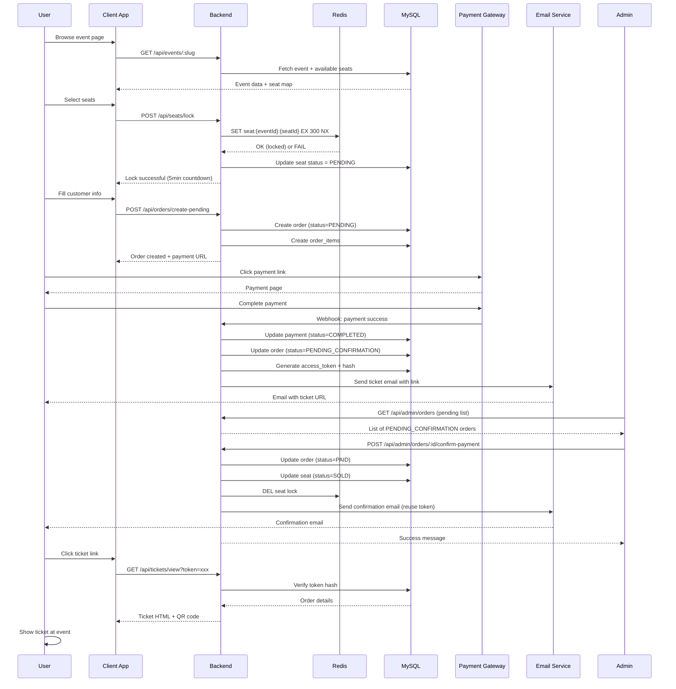
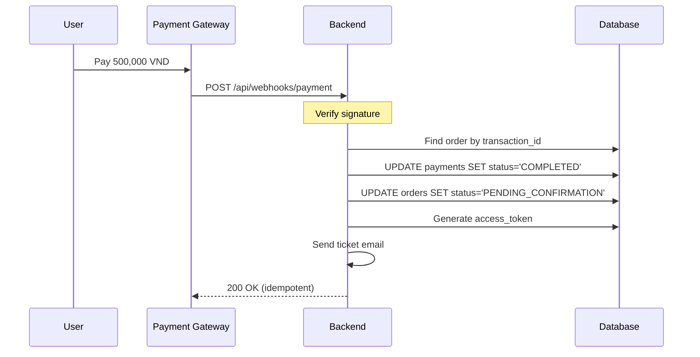
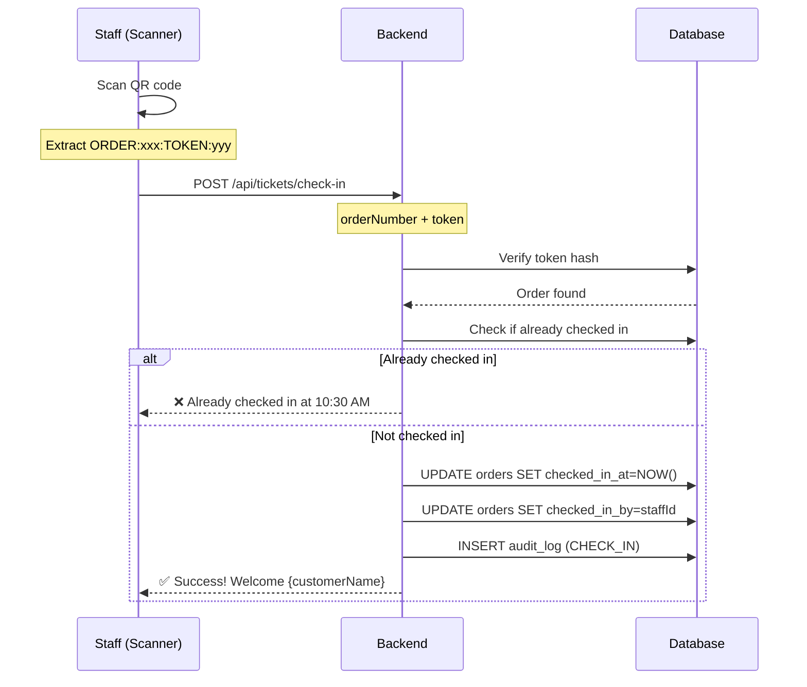
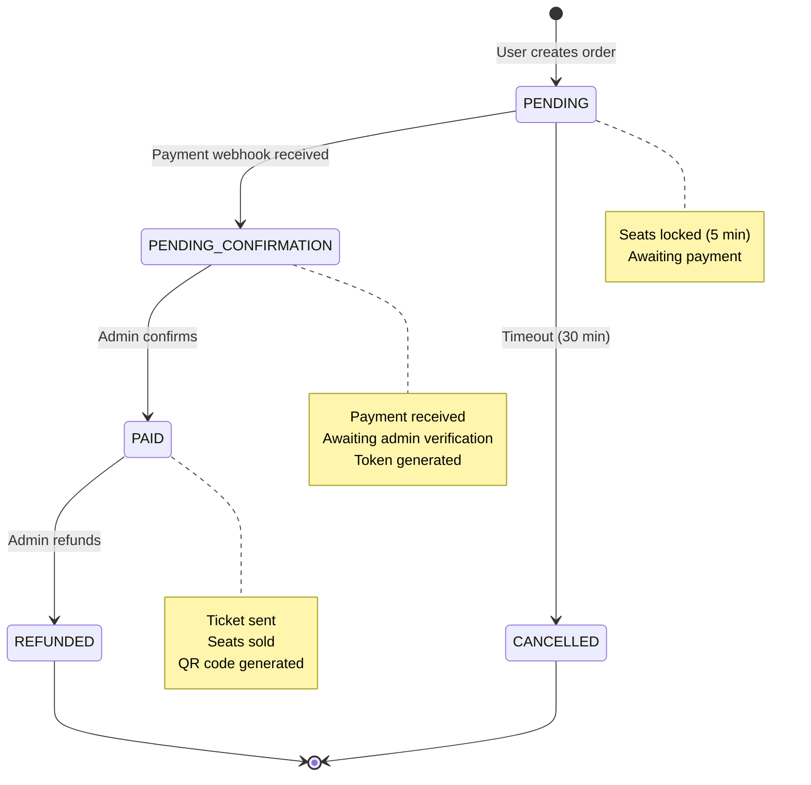

# Business Flows

> **🎯 For:** All developers (understanding business logic)  
> **📅 Last Updated:** 2026-06-13  
> **🔗 Previous:** [Database Schema](./03-database-schema.md) | **Next:** [API Reference](./05-api-reference.md)

---

## 📋 Overview

This document explains the **business processes** and **user journeys** of the ticketing platform. Read this to understand **why** the system works the way it does.

---

## 🎫 Complete Ticket Purchase Journey



---

## 🔒 Seat Locking Flow

### Problem

**Without locking:** Multiple users can buy the same seat simultaneously → Overselling

### Solution

**Redis-based distributed locking with TTL**

### Implementation

```typescript
// 1. User clicks seat
POST /api/seats/lock
{
  "eventId": "uuid",
  "seatIds": ["seat1", "seat2"],
  "sessionId": "browser-session-id"
}

// 2. Backend locks in Redis
for (const seatId of seatIds) {
  const key = `seat:${eventId}:${seatId}`
  const result = await redis.set(key, sessionId, 'EX', 300, 'NX')
  // NX = Only set if not exists (atomic)
  // EX 300 = Expire in 5 minutes

  if (result !== 'OK') {
    throw new Error('Seat already locked')
  }
}

// 3. Update DB
await prisma.seat.updateMany({
  where: { id: { in: seatIds } },
  data: { status: 'PENDING' }
})
```

### Lock Lifecycle

| Time   | Event              | Redis                             | Database                              |
| ------ | ------------------ | --------------------------------- | ------------------------------------- |
| T+0s   | User locks seat    | `seat:xxx = sessionId (TTL 300s)` | `status = PENDING`                    |
| T+120s | User creates order | Lock still active                 | Order created                         |
| T+180s | User pays          | Lock still active                 | `order.status = PENDING_CONFIRMATION` |
| T+200s | Admin confirms     | **Delete lock manually**          | `seat.status = SOLD`                  |

### Edge Cases

**Case 1: User abandons checkout**

- Redis lock expires after 5min → Auto-unlock
- Cron job resets DB: `status = AVAILABLE` for expired locks

**Case 2: User refreshes page**

- Frontend sends same `sessionId`
- Backend checks: `if (redis.get(key) === sessionId)` → Allow re-lock

**Case 3: Redis fails**

- Fallback to DB-based locking (slower)
- Use `seat_locks` table with `SELECT ... FOR UPDATE`

---

## 💳 Payment Flow

### Supported Methods

| Method        | Provider | Webhook | Manual Confirmation |
| ------------- | -------- | ------- | ------------------- |
| Bank Transfer | Manual   | ❌      | ✅ Required         |
| VNPay         | VNPay    | ✅      | ✅ Optional         |
| Momo          | Momo     | ✅      | ✅ Optional         |

### Webhook Flow (VNPay/Momo)



### Idempotency Protection

```typescript
// Webhook handler
export async function handlePaymentWebhook(payload) {
  const { transactionId, amount, status } = payload;

  // 1. Check if already processed (idempotent)
  const existing = await prisma.payment.findUnique({
    where: { transactionId },
  });

  if (existing?.webhookProcessed) {
    return { status: "already_processed" }; // Return 200
  }

  // 2. Process in transaction
  await prisma.$transaction(async (tx) => {
    await tx.payment.update({
      where: { transactionId },
      data: {
        status: "COMPLETED",
        webhookReceived: true,
        webhookProcessed: true, // ← Prevents re-processing
        paidAt: new Date(),
      },
    });

    await tx.order.update({
      where: { id: existing.orderId },
      data: { status: "PENDING_CONFIRMATION" },
    });
  });
}
```

---

## ✅ Admin Order Confirmation Flow

### Why Manual Confirmation?

**Reason:** Bank transfer payments require manual verification

### Process

1. **Admin Dashboard:** View `PENDING_CONFIRMATION` orders
2. **Verify Payment:** Check bank statement
3. **Confirm:** Click "Confirm Payment"
4. **System Actions:**
   - Update `order.status = PAID`
   - Update `seat.status = SOLD`
   - **Reuse existing access_token** (don't generate new)
   - Send confirmation email
   - Delete Redis seat lock

### Access Token Persistence

**OLD (Broken) Flow:**

```
Webhook → Generate token1 → Email with link1
Admin confirm → Generate token2 → link1 INVALID ❌
```

**NEW (Fixed) Flow:**

```
Webhook → Generate token1 → Store in DB → Email with link1
Admin confirm → Check if token exists → Reuse token1 → link1 STILL VALID ✅
```

**Implementation:**

```typescript
// In admin confirm service
let accessToken,
  accessTokenHash,
  hasExistingToken = false;

if (order.accessToken && order.accessTokenHash) {
  // Reuse existing token
  accessToken = order.accessToken;
  accessTokenHash = order.accessTokenHash;
  hasExistingToken = true;
} else {
  // Generate new token
  const generated = generateAccessToken();
  accessToken = generated.token;
  accessTokenHash = generated.hash;
}

await prisma.order.update({
  where: { id: orderId },
  data: {
    status: "PAID",
    accessToken, // Store plaintext
    accessTokenHash, // Store hash
    paidAt: new Date(),
  },
});

// Always send email (with existing or new token)
await sendConfirmationEmail({
  customerEmail: order.customerEmail,
  ticketUrl: `https://client.com/ticket?token=${accessToken}`,
});
```

---

## 🎟️ Ticket View & QR Code Flow

### Ticket Access

**URL Format:** `https://client.com/ticket/view?order={orderNumber}&token={accessToken}`

**Security:**

```typescript
// Ticket view endpoint
export async function viewTicket(orderNumber, token) {
  // 1. Hash incoming token
  const hash = sha256(token);

  // 2. Find order with matching hash
  const order = await prisma.order.findFirst({
    where: {
      orderNumber,
      accessTokenHash: hash,
    },
    include: {
      orderItems: { include: { seat: true } },
      event: true,
    },
  });

  if (!order) {
    throw new UnauthorizedError("Invalid ticket link");
  }

  // 3. Return ticket data (HTML with QR code)
  return {
    customerName: order.customerName,
    orderNumber: order.orderNumber,
    seats: order.orderItems.map((item) => item.seat.seatNumber),
    qrCode: order.qrCodeUrl,
    status: order.status,
  };
}
```

### QR Code Generation

**When:** Order status changes to `PAID`
**Content:** `ORDER:{orderNumber}:TOKEN:{accessToken}`
**Storage:** Cloudinary CDN

```typescript
import QRCode from "qrcode";
import { uploadToCloudinary } from "./cloudinary";

export async function generateTicketQR(order) {
  // 1. Generate QR data
  const qrData = `ORDER:${order.orderNumber}:TOKEN:${order.accessToken}`;

  // 2. Generate QR image (base64)
  const qrImage = await QRCode.toDataURL(qrData, {
    errorCorrectionLevel: "H",
    width: 400,
  });

  // 3. Upload to CDN
  const url = await uploadToCloudinary(qrImage, {
    folder: "tickets",
    public_id: order.orderNumber,
  });

  // 4. Save to DB
  await prisma.order.update({
    where: { id: order.id },
    data: { qrCodeUrl: url },
  });

  return url;
}
```

---

## 📧 Email Sending Flow

### Email Types

| Email Type       | Trigger                    | Template           | Variables                            |
| ---------------- | -------------------------- | ------------------ | ------------------------------------ |
| Ticket Pending   | Payment webhook            | `TICKET_PENDING`   | orderNumber, customerName, ticketUrl |
| Ticket Confirmed | Admin confirmation         | `TICKET_CONFIRMED` | orderNumber, ticketUrl, qrCodeUrl    |
| Payment Reminder | Cron (15min before expire) | `PAYMENT_REMINDER` | orderNumber, expiresAt               |
| Event Reminder   | Cron (1 day before)        | `EVENT_REMINDER`   | eventName, eventDate, ticketUrl      |

### Template System

```typescript
// Email template with variables
const template = await prisma.emailTemplate.findUnique({
  where: { purpose: "TICKET_CONFIRMED" },
});

// Replace variables
let html = template.htmlContent;
html = html.replace("{{customerName}}", order.customerName);
html = html.replace("{{orderNumber}}", order.orderNumber);
html = html.replace("{{ticketUrl}}", ticketUrl);
html = html.replace("{{qrCodeUrl}}", order.qrCodeUrl);

// Send via Resend
await resend.emails.send({
  from: "TEDx <noreply@tedxfptuhcm.com>",
  to: order.customerEmail,
  subject: template.subject,
  html,
});

// Log email
await prisma.emailLog.create({
  data: {
    orderId: order.id,
    templateId: template.id,
    purpose: "TICKET_CONFIRMED",
    recipient: order.customerEmail,
    status: "SENT",
    sentAt: new Date(),
  },
});
```

---

## 🚪 Check-In Flow

### Scanner App Flow



### Duplicate Check-In Prevention

```typescript
export async function checkInTicket(orderNumber, token, staffId) {
  const hash = sha256(token);

  const order = await prisma.order.findFirst({
    where: { orderNumber, accessTokenHash: hash },
  });

  if (!order) {
    throw new UnauthorizedError("Invalid QR code");
  }

  if (order.status !== "PAID") {
    throw new BadRequestError("Ticket not confirmed");
  }

  // Prevent duplicate check-in
  if (order.checkedInAt) {
    throw new BadRequestError(
      `Already checked in at ${order.checkedInAt.toLocaleString()}`,
    );
  }

  // Check in
  await prisma.order.update({
    where: { id: order.id },
    data: {
      checkedInAt: new Date(),
      checkedInBy: staffId,
    },
  });

  return {
    success: true,
    customerName: order.customerName,
    seats: order.orderItems.length,
  };
}
```

---

## ⏱️ Background Jobs & Cron

### Job 1: Expire Pending Orders

**Schedule:** Every 5 minutes
**Purpose:** Cancel unpaid orders after 30 minutes

```typescript
// Cron job
export async function expirePendingOrders() {
  const expiredOrders = await prisma.order.findMany({
    where: {
      status: "PENDING",
      createdAt: {
        lt: new Date(Date.now() - 30 * 60 * 1000), // 30 min ago
      },
    },
    include: { orderItems: true },
  });

  for (const order of expiredOrders) {
    await prisma.$transaction(async (tx) => {
      // Cancel order
      await tx.order.update({
        where: { id: order.id },
        data: {
          status: "CANCELLED",
          cancelledAt: new Date(),
          cancellationReason: "Payment timeout",
        },
      });

      // Release seats
      const seatIds = order.orderItems.map((i) => i.seatId);
      await tx.seat.updateMany({
        where: { id: { in: seatIds } },
        data: { status: "AVAILABLE" },
      });

      // Delete Redis locks
      for (const item of order.orderItems) {
        await redis.del(`seat:${order.eventId}:${item.seatId}`);
      }
    });
  }

  console.log(`Expired ${expiredOrders.length} orders`);
}
```

### Job 2: Event Reminder Emails

**Schedule:** Daily at 9:00 AM
**Purpose:** Send reminder 1 day before event

```typescript
export async function sendEventReminders() {
  const tomorrow = new Date();
  tomorrow.setDate(tomorrow.getDate() + 1);

  const upcomingOrders = await prisma.order.findMany({
    where: {
      status: "PAID",
      event: {
        eventDate: {
          gte: tomorrow,
          lt: new Date(tomorrow.getTime() + 24 * 60 * 60 * 1000),
        },
      },
    },
    include: { event: true },
  });

  for (const order of upcomingOrders) {
    await sendEmail({
      to: order.customerEmail,
      template: "EVENT_REMINDER",
      data: {
        customerName: order.customerName,
        eventName: order.event.name,
        eventDate: order.event.eventDate,
        ticketUrl: generateTicketUrl(order),
      },
    });
  }
}
```

---

## 🔄 Order Lifecycle State Machine



---

## 🎯 Key Business Rules

### Rule 1: Seat Lock Timeout

- Lock duration: **5 minutes**
- User can extend by clicking "Still here" button
- Auto-release on timeout

### Rule 2: Order Expiration

- Payment window: **30 minutes** from order creation
- Auto-cancel if unpaid
- Release seats back to pool

### Rule 3: Token Immutability

- Once generated, token **never changes**
- Admin confirmation **reuses** existing token
- Old links remain valid

### Rule 4: No Double Payment

- `transaction_id` UNIQUE constraint
- Webhook idempotency check
- `webhookProcessed` flag

### Rule 5: Check-In Once Only

- `checked_in_at` NOT NULL = already checked in
- Cannot check in twice
- Audit log records who performed check-in

---

**Next:** [API Reference →](./05-api-reference.md)
