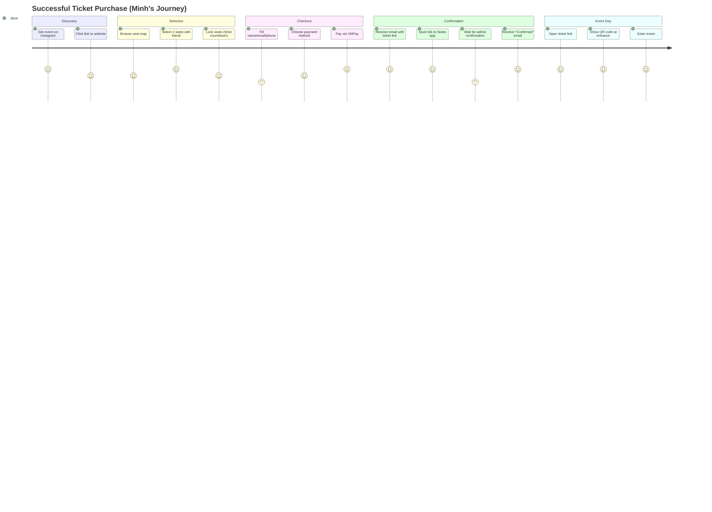
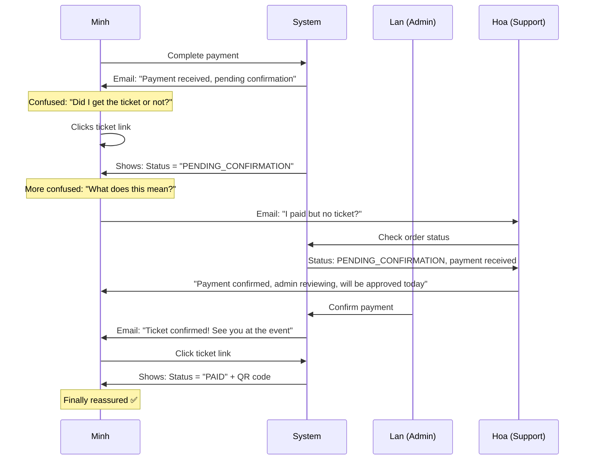

# User Stories & Business Context

> **🎯 For:** All developers (understanding WHY we build this way)  
> **📅 Last Updated:** 2026-06-13  
> **🔗 Previous:** [Deployment Guide](./09-deployment-guide.md)

---

## 👥 User Personas

### 1. Minh - University Student (Primary Customer)

**Demographics:**

- Age: 20-22
- Tech-savvy, mobile-first
- Budget-conscious (student budget)
- First-time TEDx attendee

**Goals:**

- Get tickets for TEDx event
- Secure good seats with friends
- Receive confirmation quickly
- Easy access to ticket on event day

**Pain Points:**

- Seats sold out too fast
- Complicated checkout process
- Lost confirmation emails
- Unclear payment status

**Journey:**

1. Hears about TEDx from friends/social media
2. Clicks event link on mobile
3. Browses seat map, selects seats with friends
4. Fills info quickly (doesn't want to type much)
5. Pays via mobile banking
6. Saves ticket link immediately
7. Shows QR code at entrance

**Why This Matters for Development:**

- ⚠️ Seat selection MUST be fast (<5s to lock)
- ⚠️ Mobile-first responsive design
- ⚠️ Ticket link MUST persist (can't invalidate)
- ⚠️ QR code MUST work offline

---

### 2. Lan - Event Organizer (Admin)

**Demographics:**

- Age: 25-30
- Non-technical background
- Manages 10+ events per year
- Works under pressure

**Goals:**

- Track ticket sales in real-time
- Verify bank transfers quickly
- Handle last-minute changes
- Ensure smooth check-in

**Pain Points:**

- Manual payment verification is tedious
- No clear overview of pending confirmations
- Difficult to handle refunds/cancellations
- Hard to track who checked in

**Daily Workflow:**

1. 9:00 AM - Check pending confirmations
2. 9:30 AM - Verify bank transfers
3. 10:00 AM - Confirm 20-30 orders
4. Throughout day - Handle customer inquiries
5. Event day - Monitor check-ins

**Why This Matters for Development:**

- ⚠️ Admin dashboard MUST be simple (non-tech user)
- ⚠️ Bulk actions needed (confirm multiple orders)
- ⚠️ Clear status indicators (color coding)
- ⚠️ Audit trail for accountability

---

### 3. Tuan - Door Staff (Check-in)

**Demographics:**

- Age: 19-21
- Part-time volunteer
- Minimal training (15 minutes)
- Works in noisy environment

**Goals:**

- Check in guests quickly
- Avoid duplicate entries
- Handle edge cases (lost QR, etc.)
- Keep line moving

**Pain Points:**

- QR scanner not working
- Unclear error messages
- No offline fallback
- People showing screenshots

**Check-in Scenarios:**

- ✅ Normal: Scan QR → Beep → "Welcome Minh!"
- ⚠️ Already checked in: "Already entered at 9:05 AM"
- ❌ Invalid ticket: "Ticket not confirmed, see organizer"
- ⚠️ QR broken: Manual lookup by order number

**Why This Matters for Development:**

- ⚠️ Scanner app MUST be foolproof
- ⚠️ Large, clear success/error messages
- ⚠️ Sound feedback (beep on success)
- ⚠️ Offline mode for network issues

---

### 4. Hoa - Customer Support

**Demographics:**

- Age: 23-27
- Handles 50+ inquiries per event
- Needs quick answers

**Common Inquiries:**

1. "I didn't receive my ticket email"
2. "Can I change my seats?"
3. "I paid but ticket says pending"
4. "Can I get a refund?"
5. "The link doesn't work anymore"

**Workflow:**

1. Customer emails support
2. Look up order by email
3. Check status + payment
4. Take action (resend email, explain status)
5. Log interaction

**Why This Matters for Development:**

- ⚠️ Admin search by email/phone/order number
- ⚠️ Clear order history/timeline
- ⚠️ Resend email button
- ⚠️ Order notes/comments field

---

## 🎭 User Journeys

### Journey 1: Happy Path (90% of cases)



**Key Moments:**

- 🎯 Seat selection: Must feel fast and responsive
- ⏰ Countdown timer: Creates urgency, prevents abandonment
- ✅ Instant email: Reassurance that order went through
- 🎫 Ticket link: Single source of truth

---

### Journey 2: Payment Confusion (8% of cases)

**Scenario:** User pays but doesn't understand "Pending Confirmation"



**Why This Happens:**

- User expects instant confirmation (like e-commerce)
- "Pending Confirmation" sounds like something went wrong
- Two-step process (payment → admin confirm) is confusing

**Solutions Implemented:**

1. Clear status labels: "✅ Paid - Awaiting final confirmation"
2. Estimated confirmation time: "Usually within 24 hours"
3. FAQ link in email: "Why do I need to wait?"
4. Support contact prominently displayed

**Why This Matters for Development:**

- ⚠️ Status messages MUST be user-friendly (not technical)
- ⚠️ Email copy MUST set expectations
- ⚠️ Ticket page MUST explain what "Pending" means
- ⚠️ Support lookup MUST be fast for Hoa

---

### Journey 3: Seat Lock Timeout (2% of cases)

**Scenario:** User gets distracted during checkout

```
10:00:00 - Minh selects seats A1, A2
10:00:02 - Seats locked (expires at 10:05:00)
10:00:15 - Minh starts filling form
10:02:00 - Friend calls, Minh puts phone down
10:06:00 - Minh returns, tries to proceed
10:06:01 - ERROR: "Seats no longer available"
```

**User Reaction:**

- 😡 Frustrated: "I HAD those seats!"
- 🤔 Confused: "Why did it expire?"
- 😔 Disappointed: Seats now taken by someone else

**System Behavior:**

- 10:05:00 - Redis lock expires (TTL)
- 10:05:30 - Cron job resets seat status to AVAILABLE
- 10:05:45 - Another user (Nga) locks same seats
- 10:06:01 - Minh's request fails (seats locked by Nga)

**Solutions Implemented:**

1. **Countdown timer** with visual progress bar
2. **"Still here?" button** to extend lock (+5 min)
3. **Browser alert** when user tries to leave page
4. **Grace period** (30s after expiry to complete checkout)
5. **Clear error message** with link back to seat map

**Why This Matters for Development:**

- ⚠️ Timer MUST be visible at all times
- ⚠️ Extend lock MUST be one-click (no confirmation modal)
- ⚠️ Error message MUST be empathetic + actionable
- ⚠️ Grace period prevents race conditions

---

## 🎯 Actor-Specific Workflows

### Admin Workflow: Morning Confirmation Routine

**Lan's Daily Task (30-60 minutes)**

```typescript
// Pseudo-workflow
function morningConfirmationRoutine() {
  // 1. Login to admin dashboard
  navigateTo("/admin/orders?status=PENDING_CONFIRMATION");

  // 2. See list of orders (20-50 per day)
  orders = [
    {
      orderNumber: "TKH001",
      customer: "Minh",
      amount: "500k",
      paidAt: "8:00 AM",
    },
    { orderNumber: "TKH002", customer: "Lan", amount: "1M", paidAt: "8:15 AM" },
    // ...
  ];

  // 3. For each order:
  for (order of orders) {
    // 3a. Open bank statement in another tab
    const bankStatement = checkBankApp();

    // 3b. Find matching transaction
    const transaction = findTransaction({
      amount: order.amount,
      time: order.paidAt,
      reference: order.orderNumber,
    });

    if (transaction.found) {
      // 3c. Click "Confirm Payment" button
      confirmPayment(order.id);
      // System sends email automatically ✅
    } else {
      // 3d. Mark for manual review
      flagForReview(order.id, "No matching bank transaction");
    }
  }

  // 4. Handle flagged orders
  reviewFlaggedOrders();
}
```

**Pain Points:**

- 📱 Switching between admin panel and bank app
- 🔍 Finding matching transactions (amount might differ by fee)
- ⏰ Time-consuming (2-3 minutes per order)

**Why 5-minute lock vs. instant confirm:**

- ⏱️ Admin needs time to verify (can't be instant)
- 💳 Bank transfers aren't instant (unlike credit cards)
- 🔒 Prevents fraud (manual verification layer)

---

### Staff Workflow: Event Day Check-In

**Tuan's Check-In Workflow (300-500 guests in 2 hours)**

```mermaid
flowchart TD
    Start[Guest arrives] --> HasQR{Has QR code?}
    HasQR -->|Yes| ScanQR[Scan QR code]
    HasQR -->|No| Manual[Manual lookup by order number]

    ScanQR --> Verify{Token valid?}
    Verify -->|Invalid| Error[Show error: Contact organizer]
    Verify -->|Valid| CheckStatus{Order status?}

    CheckStatus -->|PAID| CheckDuplicate{Already checked in?}
    CheckStatus -->|PENDING| Error2[Show: Ticket not confirmed yet]

    CheckDuplicate -->|Yes| ShowDupe[Show: Already entered at XX:XX]
    CheckDuplicate -->|No| Success[✅ Check in successful!]

    Success --> Beep[Play success sound]
    Beep --> ShowName[Display: Welcome {Name}!]
    ShowName --> End[Guest enters]

    Manual --> EnterOrder[Staff types order number]
    EnterOrder --> Verify

    Error --> CallOrganizer[Guest goes to help desk]
    Error2 --> CallOrganizer
    ShowDupe --> CallOrganizer
```

**Challenges:**

- 🏃 Fast throughput needed (1 guest every 15 seconds)
- 📱 QR codes on phone screens (brightness, cracks)
- 🔊 Noisy environment (need visual + audio feedback)
- 🌐 Spotty WiFi (need offline mode)

**Why This Matters for Development:**

- ⚠️ Scanner MUST work in <2 seconds
- ⚠️ Large fonts, high contrast (readable from distance)
- ⚠️ Success = Green screen + Beep
- ⚠️ Error = Red screen + Buzz + Clear message
- ⚠️ Fallback: Manual entry if QR fails

---

### Support Workflow: "I Didn't Get My Email"

**Hoa's Resolution Process (Most Common Inquiry)**

```
Customer: "I paid 2 hours ago but no email"

Hoa's Steps:
1. Ask for order number or email address
2. Look up in admin panel
3. Check order status:

   Case A: Status = PENDING (payment not received)
   → "Payment hasn't been processed yet. Did you complete the payment?"
   → Share payment link if they didn't finish

   Case B: Status = PENDING_CONFIRMATION (payment received)
   → "Payment received! Waiting for admin confirmation (within 24h)"
   → Explain the process

   Case C: Status = PAID (confirmed)
   → "Let me resend your ticket email"
   → Click "Resend Email" button
   → Check spam folder

   Case D: Order not found
   → "Can you share screenshot of payment confirmation?"
   → Create manual order if payment is valid

Average resolution time: 3-5 minutes
```

**Metrics:**

- 60% of inquiries = Case C (email went to spam)
- 25% of inquiries = Case B (impatient customers)
- 10% of inquiries = Case A (didn't complete payment)
- 5% of inquiries = Case D (system issue)

**Why This Matters for Development:**

- ⚠️ Search by email/phone/order number MUST be fast
- ⚠️ Order timeline view (payment → email sent → confirmed)
- ⚠️ "Resend Email" button prominently placed
- ⚠️ Email logs (to prove email was sent)
- ⚠️ Notes field to log support interactions

---

## 🚨 Edge Case Scenarios

### Scenario 1: Concurrent Seat Selection

**Problem:** 2 users click same seat simultaneously

```
10:00:00.000 - Minh clicks seat A1
10:00:00.150 - Nga clicks seat A1
10:00:00.200 - Minh's request hits Redis
10:00:00.201 - Redis SET NX succeeds (Minh wins)
10:00:00.250 - Nga's request hits Redis
10:00:00.251 - Redis SET NX fails (seat already locked)
10:00:00.300 - Minh sees: "Seat locked successfully"
10:00:00.301 - Nga sees: "Seat A1 is already taken"
```

**Why Redis Atomic Operations:**

- `SET key value EX 300 NX` is atomic (one wins, one fails)
- No race condition possible
- Fair: First request to reach Redis wins

**Alternative (Slow & Broken):**

```javascript
// ❌ DON'T DO THIS (race condition)
const exists = await redis.get(key);
if (!exists) {
  await redis.set(key, sessionId); // Too late! Another request got here
}
```

---

### Scenario 2: Payment Webhook Arrives Twice

**Problem:** Payment gateway sends webhook multiple times

```
10:00:00 - Payment completed
10:00:01 - Webhook #1 arrives → Process order
10:00:05 - Webhook #2 arrives (retry) → ???
10:00:10 - Webhook #3 arrives (retry) → ???
```

**Without Idempotency:**

```
Webhook #1: Create payment record, send email ✅
Webhook #2: Create DUPLICATE payment, send DUPLICATE email ❌
Webhook #3: Create another duplicate... ❌❌
```

**With Idempotency:**

```typescript
const existing = await prisma.payment.findUnique({
  where: { transactionId: webhook.transactionId },
});

if (existing?.webhookProcessed) {
  return { status: "already_processed" }; // Return 200 OK
}

// Only process if not already processed
await processPayment(webhook);
```

**Result:**

```
Webhook #1: Process ✅
Webhook #2: Skip (already processed) ✅
Webhook #3: Skip (already processed) ✅
```

---

### Scenario 3: User Refreshes During Checkout

**Problem:** User refreshes page after locking seats

```
10:00:00 - User locks seats A1, A2 (sessionId = "abc123")
10:00:30 - User refreshes page (loses state)
10:00:31 - User selects same seats again
10:00:32 - System checks: Who locked A1?
```

**Solution: Session-based Lock Ownership**

```typescript
const currentLock = await redis.get(`seat:${eventId}:${seatId}`);

if (currentLock === null) {
  // Not locked, proceed
  return lockSeat(seatId, sessionId);
} else if (currentLock === sessionId) {
  // Same user, allow re-lock (extend TTL)
  return extendLock(seatId, sessionId);
} else {
  // Locked by someone else
  throw new Error("Seat taken by another user");
}
```

**Why sessionId:**

- Generated on page load, stored in localStorage
- Survives page refresh
- User can return to checkout without losing seats

---

### Scenario 4: Network Failure During Confirmation

**Problem:** Admin clicks "Confirm Payment" but network drops

```
Admin clicks → Request sent → Network timeout → ???

Did the order get confirmed or not?
```

**Solution: Idempotent Requests**

```typescript
// Backend
export async function confirmPayment(orderId: string) {
  const order = await prisma.order.findUnique({ where: { id: orderId } });

  // Already confirmed? Return success (idempotent)
  if (order.status === "PAID") {
    return { success: true, message: "Already confirmed" };
  }

  // Proceed with confirmation
  await updateOrderStatus(orderId, "PAID");
  await sendEmail(order);

  return { success: true, message: "Payment confirmed" };
}
```

**Result:**

- Admin clicks once → Timeout
- Admin clicks again → Success (no duplicate email)

---

## 📐 Business Rules & Constraints

### Rule 1: Why 5-Minute Seat Lock?

**Too Short (30 seconds):**

- ❌ User can't finish filling form
- ❌ Stressful experience
- ❌ High abandonment rate

**Too Long (30 minutes):**

- ❌ Seats unavailable for too long
- ❌ Users forget and don't complete
- ❌ Inventory appears sold out when it's not

**5 Minutes (Sweet Spot):**

- ✅ Enough time to fill form (avg. 2-3 min)
- ✅ Creates urgency (countdown timer)
- ✅ Quickly releases abandoned seats
- ✅ Industry standard (Ticketmaster, Eventbrite use 5-10 min)

**Business Data:**

- 85% of users complete checkout within 3 minutes
- 10% need 3-5 minutes
- 5% abandon (timer expired)

---

### Rule 2: Why Manual Admin Confirmation?

**Why not auto-confirm after payment?**

**Reason 1: Payment Method**

- VNPay/Momo: Webhook confirms automatically → Still needs admin check
- Bank Transfer: No webhook → Manual verification required

**Reason 2: Fraud Prevention**

- Screenshot spoofing (fake payment receipts)
- Stolen credit cards
- Chargeback risk

**Reason 3: Business Policy**

- TEDx is invitation-based community event
- Organizers review each attendee
- Right to reject inappropriate registrations

**Future Improvement:**

- Auto-confirm for trusted payment methods (VNPay)
- Manual review only for bank transfers

---

### Rule 3: Why Persist Access Token?

**Original Design (Broken):**

```
Payment → Generate token1 → Email link1
Admin confirms → Generate token2 → link1 BREAKS ❌
```

**Problem:**

- User saves link1 to phone
- Admin confirms payment
- User clicks link1 → "Invalid ticket" ❌
- User panics, contacts support

**New Design (Fixed):**

```
Payment → Generate token1 → Store in DB → Email link1
Admin confirms → Reuse token1 → link1 STILL WORKS ✅
```

**Trade-off:**

- Security: Storing plaintext token in DB is risky
- UX: User experience is MUCH better
- Decision: UX wins (tickets are not bank accounts)

**Mitigation:**

- Database access restricted
- Audit logs for token access
- Token is order-specific (limited damage if leaked)

---

### Rule 4: Why Hash AND Plaintext?

**Storage:**

- `access_token` = plaintext (for email links)
- `access_token_hash` = SHA-256 hash (for verification)

**Why Both?**

**Plaintext (email links):**

```
Email: "View your ticket: https://tedx.com/ticket?token=abc123..."
                                                          ^^^^^^
                                                       Need plaintext!
```

**Hash (verification):**

```typescript
// When user visits link
const incomingToken = req.query.token;
const hash = sha256(incomingToken);
const order = await db.findOne({ accessTokenHash: hash });
```

**Why not store plaintext only?**

- Database breach → All tokens exposed
- Hash provides defense-in-depth

**Why not hash only?**

- Can't send email links (need plaintext)
- Would need to generate new token on every resend (bad UX)

---

### Rule 5: Max Seats Per Order

**Limit: 10 seats per order**

**Why?**

- Prevents ticket hoarding
- Ensures fair distribution
- Simplifies group management

**Business Data:**

- 70% of orders: 1-2 seats (individuals/couples)
- 25% of orders: 3-5 seats (friend groups)
- 5% of orders: 6-10 seats (student clubs)
- 0.1% requests: 10+ seats → Rejected, asked to split orders

**Technical Implementation:**

```typescript
const createOrderSchema = z.object({
  seatIds: z
    .array(z.string().uuid())
    .min(1, "Must select at least 1 seat")
    .max(10, "Maximum 10 seats per order"),
});
```

---

## 🎓 Developer Takeaways

### For Junior Developers:

**Before coding, ask:**

1. **Who** is this feature for? (Which persona?)
2. **Why** do they need it? (What problem does it solve?)
3. **When** will they use it? (In which workflow?)
4. **What** happens if it fails? (Edge cases?)

**Example:**

- Feature: "Resend Email" button
- Who: Customer support (Hoa)
- Why: 60% of inquiries are "didn't get email"
- When: During support call (needs to be fast)
- What if fails: Show clear error, log for debugging

---

### For Senior Developers:

**When reviewing PRs:**

1. Does this align with user personas?
2. Are edge cases handled?
3. Is the UX empathetic? (Error messages, loading states)
4. Does it scale? (Check-in: 500 guests in 2 hours)

**Example PR Review:**

```
// ❌ Bad error message
throw new Error('Token invalid')

// ✅ Good error message
throw new Error('This ticket link is no longer valid. Please contact support at support@tedx.com')
```

---

**End of User Stories & Business Context** ✅

**Next Steps:**

- Review this document with product/business team
- Use personas when designing new features
- Reference workflows when debugging user-reported issues
- Update as business rules change
